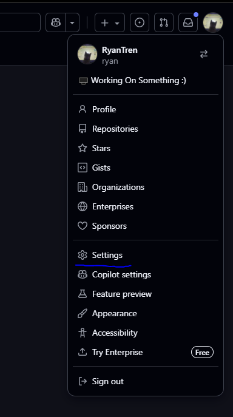
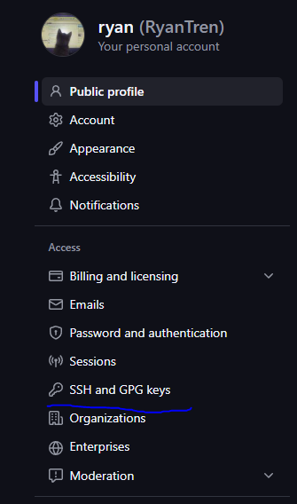
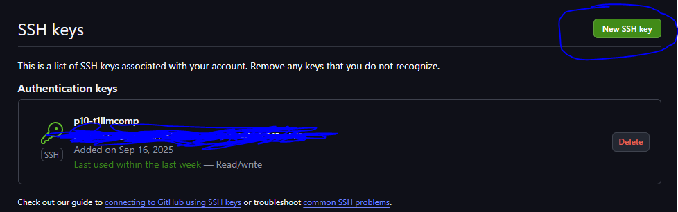

# Backend Setup
## Connecting to VM

1) Download GlobalProtect VPN from KSU 
* [vpn to download for VM](https://campus.kennesaw.edu/offices-services/uits/security/vpn.php)
* [guide to connect to vpn](https://kennesaw.service-now.com/sp?id=kb_article_view&sysparm_article=KB0013387&sys_kb_id=31c272b4972fea90c475f977f053afbb&spa=1)
* download puTTy

### SSH into VM with this Login
```
puTTY: ssh p10-t1llmcomp@10.96.50.42
pw: p10-t1llmcomp
```

## Setup Github Repo on VM
Ryan - Okay so when I initially tried to ``git clone`` the repo I got an authentication error. This happened because GitHub actually disabled password authentication for Git over HTTPS so to clone this repo you need to create an SSH key
```bash
ssh-keygen -t ed25519 -C "whateveremailyourgithubislinkedto@gmail.com"
cat ~/.ssh/id_ed25519.pub
eval "$(ssh-agent -s)"
ssh-add ~/.ssh/id_ed25519.pub
```
Now copy the SSH Key and follow the steps below...







```bash
ssh -T git@github.com #double checks if github is authenticated
git clone https://github.com/RyanTren/AFB-LLM-Compression-Trade-off-Evaluator

ls -lrt
```
And the Repo folder should pop-up in the VM now!

* If for some reason the VM doesn't contain your ssh key anymore run this:
```bash
cd ~/AFB-LLM-Compression-Trade-off-Evaluator
git remote set-url origin git@github.com:RyanTren/AFB-LLM-Compression-Trade-off-Evaluator.git

ssh -T git@github.com
# this is to test the connection and if it's successfull you should be able to fetch, pull, commit, and push like normal!
```


