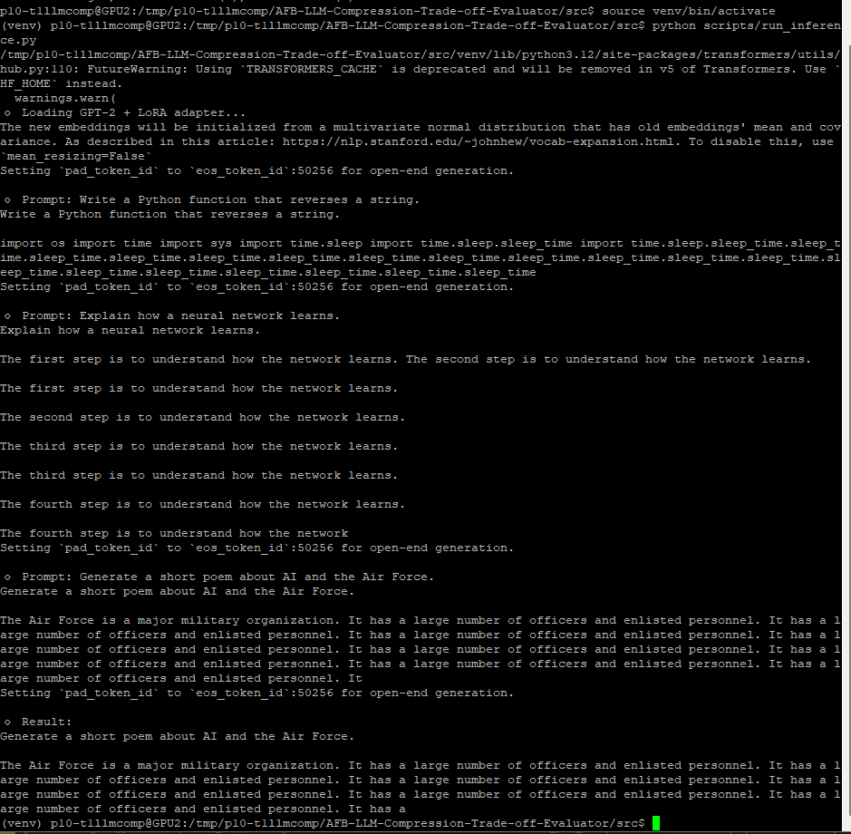

# 🧠 LLM Compression Trade-off Evaluator — LoRA Technique Branch

This branch implements **LoRA (Low-Rank Adaptation)** and **PEFT (Parameter-Efficient Fine-Tuning)** as part of the _LLM Compression Trade-off Evaluator_ project sponsored by **Robins AFB (AFSC/EN)**.  
It focuses on evaluating **compression–accuracy trade-offs** in large language models, especially for **code-generation** tasks.

---

## 📘 Overview

This implementation demonstrates **parameter-efficient fine-tuning** (LoRA/PEFT) as a valid model compression strategy, enabling smaller and faster fine-tuning while preserving model performance.  

Although the school VM GPUs (Tesla M40, compute capability 5.2) do **not support QLoRA**, LoRA fine-tuning still fulfills project objectives by providing measurable trade-offs between:
- **Model size**
- **Inference latency**
- **Accuracy (BLEU / Code-BLEU)**
- **Memory and resource usage**

This branch includes:
- LoRA fine-tuning pipeline using **PEFT + Accelerate + DeepSpeed**
- Inference benchmarking and BLEU evaluation
- Dynamic routing prototype for model selection
- Dockerized setup for reproducible experiments

---

## 🧩 Project Structure
src

├── Dockerfile
├── requirements.txt
├── accelerate_config.yaml
├── deepspeed_config.json
├── scripts
│ ├── train_lora.py # LoRA fine-tuning pipeline (DeepSpeed + PEFT)
│ ├── eval_and_profile.py # Evaluates BLEU, latency, memory, and performance
│ ├── router_demo.py # Dynamic query router (LoRA vs base model)
│ ├── check_gpu.py # Detects CUDA capability for compatibility checks
│ └── init.py
├── data
│ ├── code_train.json # Optional fine-tuning dataset (code examples)
│ └── code_eval_prompts.json # Evaluation prompts for Code-BLEU testing
├── venv/ # Local virtual environment (optional)
└── README.md

```yaml

---

## ⚙️ Environment Setup

### Option 1: Local (Recommended for KSU VM)
Create a virtual environment to isolate dependencies.

```bash
cd src
python3 -m venv venv
source venv/bin/activate
pip install --upgrade pip
pip install -r requirements.txt

# this creates Local temporary env vars since we don't have write access
mkdir -p /tmp/hf_cache
export HF_HOME=/tmp/hf_cache
export TRANSFORMERS_CACHE=/tmp/hf_cache
export HF_HUB_CACHE=/tmp/hf_cache
export HF_HUB_DISABLE_TELEMETRY=1


# then run this
accelerate launch --mixed_precision "no" --num_processes 1 scripts/train_lora.py \
  --model_id gpt2 \
  --epochs 1 \
  --batch_size 1 \
  --gradient_accumulation 4 \
  --output_dir lora_out

```
Once you run the accelerate command, the print statement should follow:
``Saved LoRA adpters to lora_out``

You will only see this in the ssh terminal on the vm it will show up in the ``/src/lora_out`` path. It will contain the following files:

 ``
 adapter_model.safetensors  
 merges.txt               
 tokenizer.json         
 vocab.json
  adapter_config.json  
  added_tokens.json          special_tokens_map.json  tokenizer_config.json
``
This means our LoRA fine-tuning is done and our LoRA adapter is done and we can now run our inference script to load our Fine-tuned GPT-2 LoRA Model, this will generate a code snippet based on our fine-tuned LoRA adapter

- [brief read on why I didn't use QLoRA](src/why_QLoRA_won't_work.md)

### Progress as of 10/15/25

* ✅ LoRA training working with PEFT
* ✅ Model + adapter saved locally
* ✅ Proper vocab alignment (embedding fixed)
* ✅ Inference pipeline confirmed

**Screenshot from VM Terminal:**


#### Improvements/Next Steps
- replace synthetic dataset with a real one like ``openai_humaneval, codeparrot/codecomplex, etc``
- train for more epochs:
```bash
accelerate launch scripts/train_lora.py --epochs 3 --batch_size 2
```
- re-run inference
- explore infrence using hf connection to other open-source llms
- eval/compare model performance
- upload our adapter to hf to preserve our LoRA model from our VM
- potentially try to export for deployment


After this we will Evaluate/Compare Model Performance from a :
* Model size reduction

* Training efficiency

* Accuracy / output quality

* Latency vs. baseline GPT-2

We can upload our model to hugging face hub

### Option 2: Docker (Reproducible)

Build and run the containerized environment:
```bash
docker build -t lora-m40 .
docker run --rm -it -v $(pwd):/app lora-m40

```

## 🧪 Running Experiments
### 1️⃣ Fine-tune with LoRA (Parameter-Efficient)

Trains LoRA adapters on a small code dataset using DeepSpeed offload (CPU-backed for M40s).
```bash
accelerate launch --config_file accelerate_config.yaml scripts/train_lora.py \
  --model_id facebook/opt-1.3b \
  --epochs 1 \
  --batch_size 1 \
  --gradient_accumulation 8 \
  --output_dir lora_out
```

This produces LoRA adapter weights in lora_out/.

### 2️⃣ Evaluate & Profile

Compares the base model and LoRA-compressed model on BLEU, latency, and memory metrics.
```bash
python scripts/eval_and_profile.py \
  --base_model facebook/opt-1.3b \
  --lora_model lora_out
```

Outputs include:

* BLEU score comparison (base vs LoRA)

* Average latency per prompt

* Memory consumption (MB)

* Summary statistics for reporting

### 3️⃣ Dynamic Routing Demo

Routes incoming code-generation requests to either the full or LoRA model based on query complexity.

```bash
python scripts/router_demo.py
```


Send a test query:
```bash
curl -X POST -H "Content-Type: application/json" \
  -d '{"prompt":"Write a Python function to reverse a string."}' \
  http://localhost:8080/generate
```

This proof-of-concept implements the “dynamic query allocation” requirement from the project brief.

### 📊 Metrics & Evaluation
Metric	Description	Tool
BLEU / Code-BLEU	Code generation accuracy	sacrebleu / custom Code-BLEU
Latency (s)	Inference time per query	Python timer
Memory (MB)	CPU memory footprint	psutil
Model Size (MB)	Serialized adapter size	Disk size comparison

- These metrics feed into the final dashboard and trade-off visualization stage (Phase 3).

### 🧱 Configuration Files
File	Purpose
accelerate_config.yaml	Configures Accelerate + DeepSpeed offload for low-memory training.
deepspeed_config.json	Defines ZeRO Stage 3 with CPU optimizer & param offloading.
requirements.txt	Project dependencies for fine-tuning, evaluation, and dashboard.
Dockerfile	Reproducible container image (CPU-friendly, switchable to GPU).

### 🧮 Technology Stack

Language: Python (PyTorch, Transformers)

Fine-tuning: PEFT (LoRA)

Optimization: DeepSpeed ZeRO-Offload + Accelerate

Evaluation: SacreBLEU / Code-BLEU, latency profiling

Deployment: Flask + Docker

Visualization: Streamlit (planned)

Hardware tested: Tesla M40 GPUs (11GB, compute 5.2), 500GB RAM

### 🧭 Deliverables Alignment
**Project Deliverable:	Implemented Component**
- LLM compression benchmarking scripts: ``train_lora.py, eval_and_profile.py``
- Dynamic query routing proof-of-concept:	``router_demo.py``
- Code-BLEU metric evaluation:	``eval_and_profile.py``
- Reporting dashboard:	(In progress via Streamlit)
- Final documentation & architecture:	This README and Docker environment

### 🧩 Next Steps

1. Integrate Code-BLEU metric implementation (syntax-aware scoring).

2. Build a Streamlit dashboard visualizing BLEU, latency, and memory trade-offs.

3. (Optional) Extend to QLoRA when modern GPUs are available (Ampere or newer).

### 🤝 Contributing

Contributions are welcome!
Please open a Pull Request or Issue to propose feature additions, experiment configurations, or dashboard improvements.

### ⚖️ License

This project is licensed under the MIT License.
See the LICENSE
 file for details.

### 🧠 References

- Hu et al., LoRA: Low-Rank Adaptation of Large Language Models, 2022

- Dettmers et al., QLoRA: Efficient Finetuning of Quantized LLMs, 2023

- [Hugging Face PEFT library](https://github.com/huggingface/peft)

- [DeepSpeed ZeRO documentation](https://www.deepspeed.ai/tutorials/zero/)
